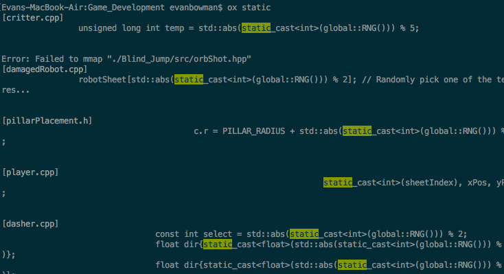

# Oxide

## Introduction
Oxide (ox) is a simple pattern matching tool, inspired by Ack and Grep, and written in Rust. By running in parallel, mmap'ing files, and ignoring hidden directories, it performs faster than Ack or Grep for searching code bases.

<p align="center"></p>

## Usage
Using ox is very straightforward. To do a multithreaded recursive search of a file tree:
```
ox <pattern>
```

In the future, the tool will eventually support command line options parsing and much of grep and ack's functionality.

## Installation
This project uses Cargo for building and resolving dependencies.
```
cargo build --release
```
Then move it to the directory where your shell looks for commands. Maybe I'll put it on homebrew, apt-get etc.. when I'm done.
